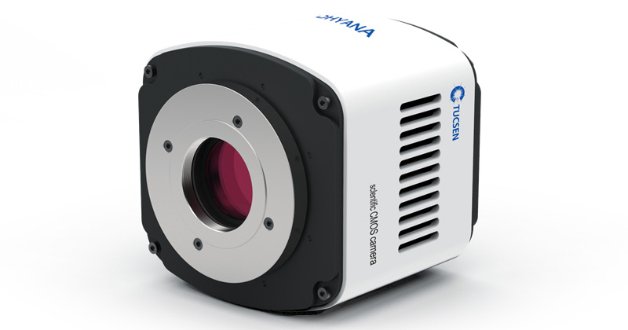
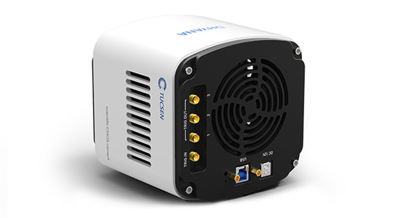
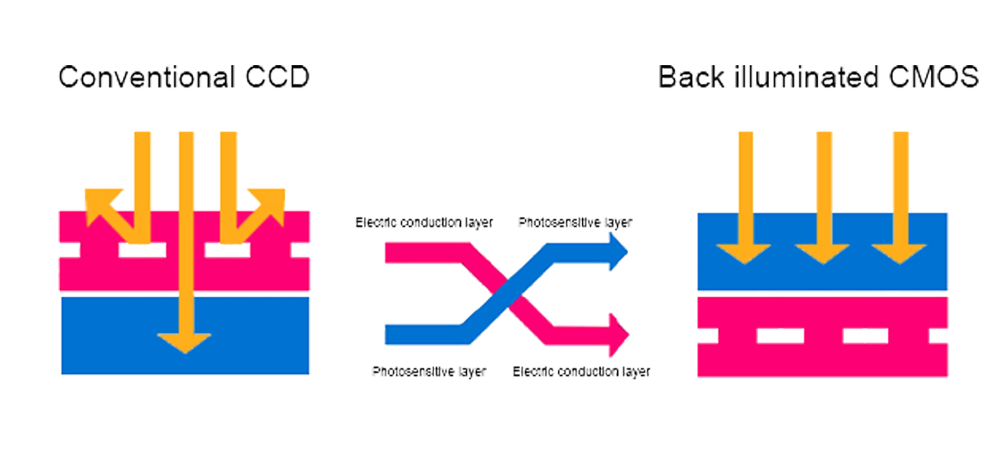

.. _camera-dhyana:

Tucsen / Dhyana
---------------------------




The Dhyana95 uses backside-illuminated sCMOS thinned chip technology to avoid light interference from the wiring layer, 
thereby increasing the pixel area and improving the photoelectric conversion rate.



Intoduction
```````````
This plugin control a TUCSEN Dhyana (95) camera under WINDOWS, using TUCam (32 bits) SDK 1.0.0.9 library.

Linux is supported as well using the TUCam SDK (x86_64) for Linux, release. 1.0.0.0.

To get the SDK please contact your camera seller.


Prerequisite
````````````

The Dhyana 95 is only supporting USB3 interface. On Linux USB device can only be accessed by root user.
To allow any user to control the camera you should manually change the udev settings for this particular usb device.
As root create a new file under /etc/udev/rules.d/99-tucsen.rules add the following udev rules:

.. code-block::
  ATTR{idVendor}=="5453", MODE="0666"

Then you can simply unplug your camera, restart the computer and then plug the camera

Installation & Module configuration
````````````````````````````````````

Follow the generic instructions in :ref:`build_installation`. If using CMake directly, add the following flag:

.. code-block:: sh

  -DLIMACAMERA_DHYANA=true

For the Tango server installation, refers to :ref:`tango_installation`.
  

Initialisation and Capabilities
````````````````````````````````

Implementing a new plugin for new detector is driven by the LIMA framework but the developer has some freedoms to choose which standard and specific features will be made available. This section is supposed to give you the correct information regarding how the camera is exported within the LIMA framework.


Camera initialisation
......................

There is no initialisation to perform, just be sure your camera is switched on and connected on the computer via the USB cable.


Std capabilites
................

This plugin has been implemented in respect of the mandatory capabilites .

* HwDetInfo

 It only supports Bpp16.

* HwSync

  Supported trigger mode are:
   - IntTrig
   - ExtTrigSingle
   - ExtTrigMult
   - ExtGate
  
  
Optional capabilites
........................

* Rolling (standard) vs. Global shutter

  The camera can support different trigger modes, please refer to the documentation for more details.
  The camera plugin provides commands to change the trigger (shutter) mode, from standard (rolling) to
  global. An other mode calls "synchronous" is also available.

* Cooling

  - Cooling method : Peltier cooling
  - Cooling temperature : Forced air (Ambient at +25 Celsius): -10 Celsius
  - The TUCam SDK allows accessing the temperature target (R/W).

* HwRoi

  Roi parameters (x, y , width, height), thanks to Lima you can set any Roi but
  to activate a real Hw Roi the camera only support x offset as factor of 4 and width as factor of 8.


* HwBin

  There is no hardware support for binning.


* HwShutter

  There is no shutter control.

Configuration
`````````````

No Specific hardware configuration are needed


Getting started
```````````````

For a quick test one can use the python binding, here is a short code example:

.. code-block:: python

  from Lima import Dhyana
  from lima import Core
  import time

  cam = Dhyana.Camera()

  # set temperature cooling
  cam.setTemperatureTarget(-10)

  # Get the hardware interface
  hwint = Dhyana.Interface(cam)

  # Get the control interface
  control = Core.CtControl(hwint)

  # Get the acquisition control
  acq = control.acquisition()

  # Set new file parameters and autosaving mode
  saving=control.saving()

  pars=saving.getParameters()
  pars.directory='/tmp/'
  pars.prefix='test1_'
  pars.suffix='.edf'
  pars.fileFormat=Core.CtSaving.EDF
  pars.savingMode=Core.CtSaving.AutoFrame
  saving.setParameters(pars)

  # Now ask for 2 sec. exposure and 10 frames
  acq.setAcqExpoTime(2)
  acq.setAcqNbFrames(10)

  control.prepareAcq()
  control.startAcq()

  # Wait for last image (#9) ready
  lastimg = control.getStatus().ImageCounters.LastImageReady
  while lastimg !=9:
    time.sleep(0.1)
    lastimg = control.getStatus().ImageCounters.LastImageReady

  # read the first image
		im0 = control.ReadImage(0)
